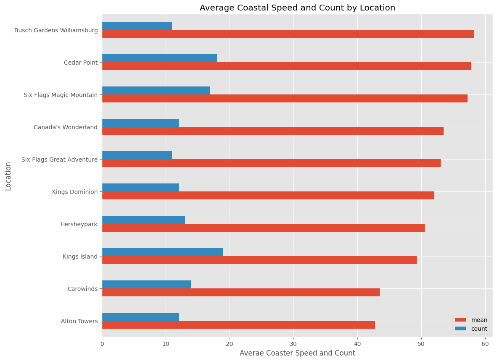

# Exploratory Data Analysis of a RollerCoaster DataBase

This is an exploratory data analysis project carried on a database containing 1087 rollercoasters around the world and also with 56 columns of different variables such as Speed, Location, Status, Manufacturer, etc. The data frame was trimmed down to contain only 13 variables of interest, and exploration done on this 13 variables. Data types was changed to their proper data types such as correcting the year_introduced variable from integer to pandas datetiime, etc. Checking for duplicated rollercoasters and removing them.

Then a Univariate analysis was done, visualizing single variable such as year_introduced with a barchart and speed(mph) with a histogram.

Feature Relationships was also carried out by making a scatterplot of Height vs speed of the rollercoasters and coloring this scatterplot based on the year_introduced (using the hue argument of the seaborn library). A pairplot and heatmap of the numeric variables were also carried out, for identification of patterns between variables.

Finally, the question was asked, what are the locations with a minimum of 10 rollercoasters and which locations have the mean fastest rollercoasters?. An answer to this question is presented using the barchart as below: 

